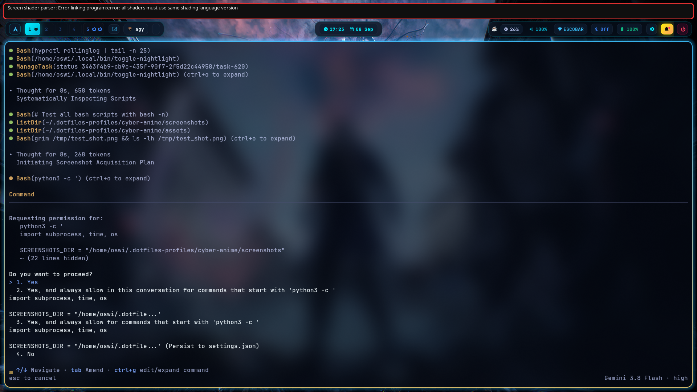
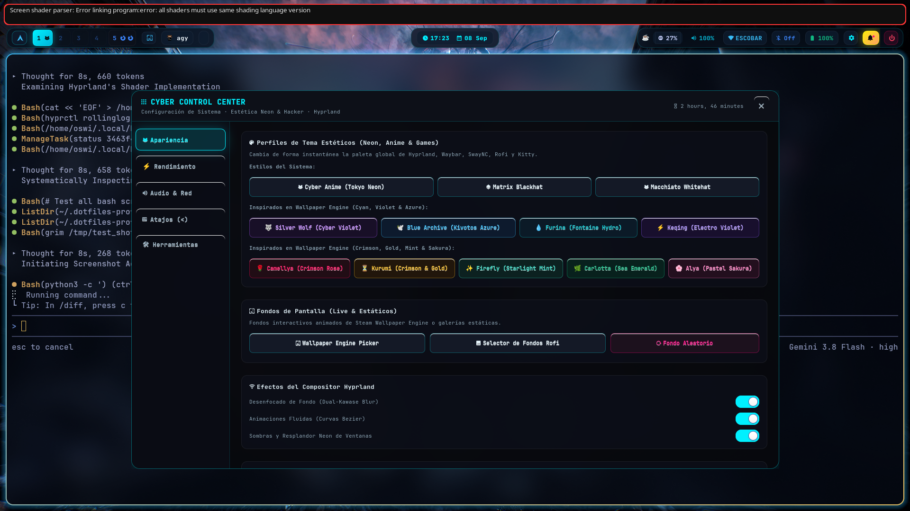
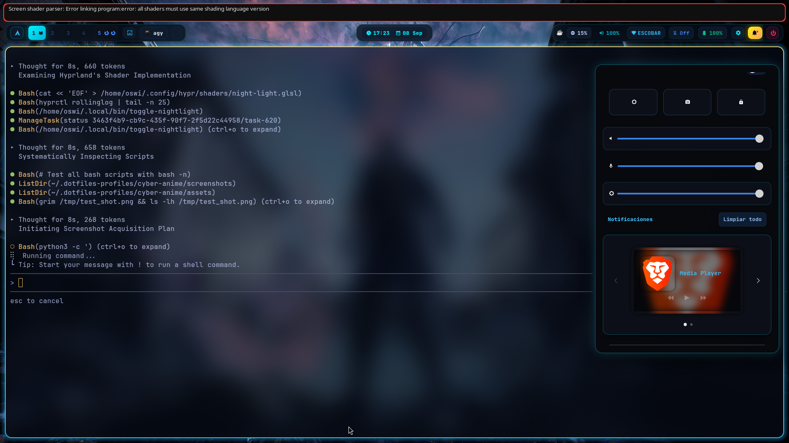
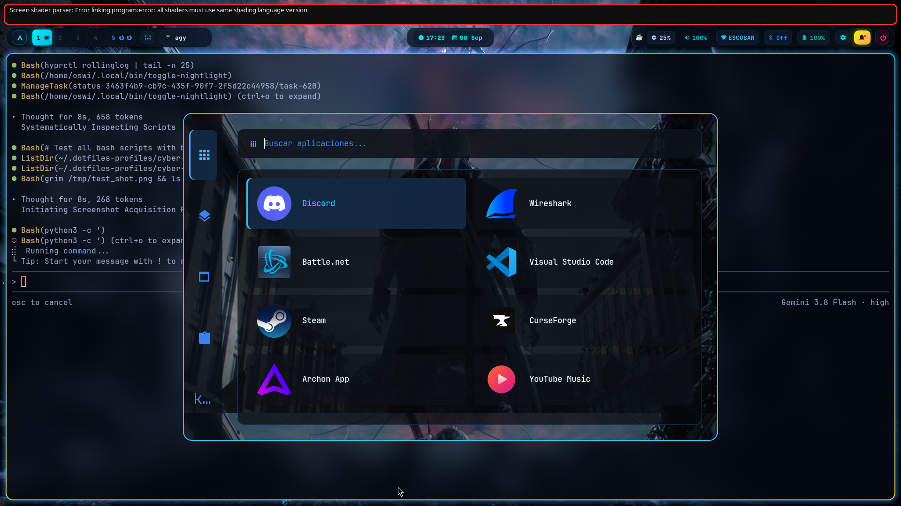
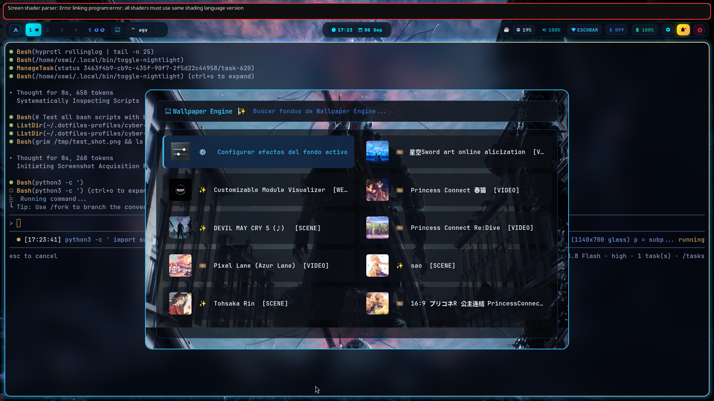
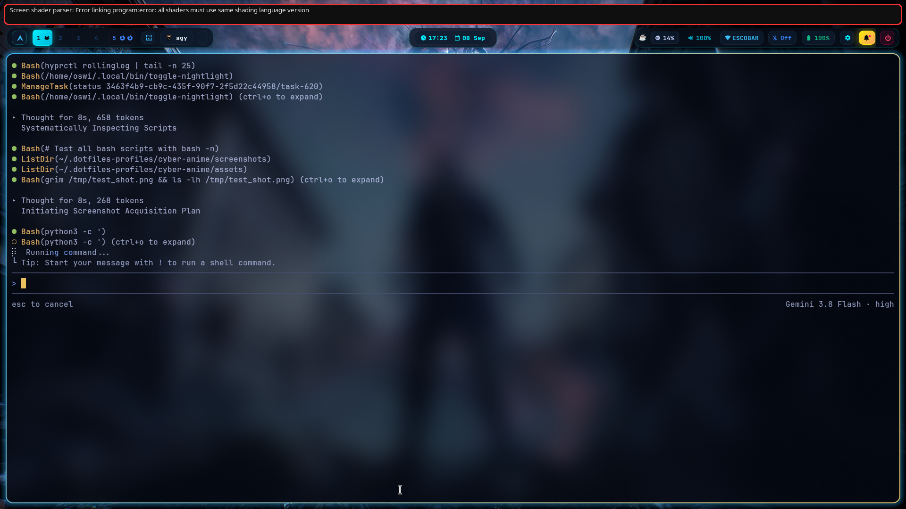

# Cyber-Anime Dotfiles 󱗼

[](https://archlinux.org)
[](#-catálogo-de-los-12-temas)
[](#)
[](#)

Entorno de escritorio cyberpunk y anime de alto rendimiento para **Arch Linux** y **Hyprland** (configuración modular en **Lua**), diseñado para ser estético, fluido, responsivo y completamente personalizable sin sobrecargar el sistema.

<p align="center">
  
</p>

---

## 📸 Galería Visual

| Panel de Control (`cyber-settings`) | Centro de Control (`SwayNC`) |
| :---: | :---: |
|  |  |
| *Cuadrícula interactiva con los 12 temas neón listos para alternar* | *Acciones rápidas esenciales sin duplicados y sliders de volumen/brillo* |

| Cajón de Aplicaciones (`Super + A`) | Selector Wallpaper Engine (`Super + W`) |
| :---: | :---: |
|  |  |
| *Ventana unificada 1140×700px con iconos destacados y cristal translúcido* | *Explorador de fondos de Steam Workshop en 1080p con animación elástica* |

| Gestor Wi-Fi Nativo (`rofi-wifi`) | Monitor de Recursos (`btop`) |
| :---: | :---: |
|  |  |
| *Lista inteligente con potencia de señal y autenticación Rofi* | *Monitoreo en tiempo real de CPU, GPU, RAM, temperaturas y procesos* |

---

## 󰀻 Características Principales

- **Suite Multitema Dinámica y Armonización Total (12 Paletas Predefinidas):**
  - Colección de temas inspirados en estética Cyberpunk y personajes de anime/juegos (*Honkai: Star Rail*, *Genshin Impact*, *Blue Archive*, *Date A Live*, *Roshidere*, *Wuthering Waves*).
  - **Detección y Sincronización Automática al Escoger Cualquier Fondo (`theme_utils.py`):**
    - Al seleccionar un fondo en `wpe-picker` o `rofi-wallpaper`, el motor inteligente de cuantización de color en mediana (PIL Lanczos/MedianCut) analiza la imagen/fotograma en <20ms, calcula la distancia perceptual HSV contra las 12 paletas y aplica automáticamente el tema con mayor afinidad cromática.
    - Respaldado por heurística de palabras clave de personajes y franquicias para reconocimiento exacto.
  - **Armonización Visual Total de TODAS las Ventanas y Elementos:**
    - **Hyprland**: Bordes activos con gradientes dobles a 45° y resplandores luminosos (`decoration.shadow`, `range = 14`, `render_power = 2`, `shadow.color` calibrado con canal alfa traslúcido para cada paleta).
    - **Waybar**: Píldoras traslúcidas (`@pill-bg`), acento activo (`@accent-active`), indicadores de workspaces activos y tooltips estilizados.
    - **SwayNC (`Super + N`)**: Tarjetas de notificación con resplandor (`box-shadow`), centro de control, botones de acción (`buttons-grid`) y sliders sin restos de cyan hardcodeado.
    - **Wlogout (`Super + Esc`)**: 12 temas CSS dedicados en `.config/wlogout/themes/`, bordes con resplandor neón `@accent-glow` y `@accent-sec-glow` al pasar el cursor.
    - **Cyber Settings (`Super + I` / `Super + S`)**: Mutación visual en caliente en tiempo real al seleccionar cualquier tema; bordes, títulos, botones de navegación activos y sliders en gradiente.
    - **Popups de Reloj y Audio (`calendar-popup` & `volume-popup`)**: Ventanas emergentes de Layer-Shell sincronizadas en tiempo real con la paleta y sombras resplandecientes del tema activo.
    - **Rofi**: 4 interfaces unificadas ([`launcher.rasi`](.config/rofi/launcher.rasi), [`wpe.rasi`](.config/rofi/wpe.rasi), [`wallpaper.rasi`](.config/rofi/wallpaper.rasi), [`dialog.rasi`](.config/rofi/dialog.rasi)).
    - **Kitty, Fastfetch y Hyprlock**: Paletas idénticas y coherentes en el emulador de terminal, pantalla de bloqueo y fetch del sistema.

- **Ventanas y Selectores Unificados (1140×700px Glassmorphism):**
  - El cajón de aplicaciones ([`launcher.rasi`](.config/rofi/launcher.rasi)), el selector de Wallpaper Engine ([`wpe.rasi`](.config/rofi/wpe.rasi)) y el selector de fondos estáticos ([`wallpaper.rasi`](.config/rofi/wallpaper.rasi)) comparten exactamente las mismas dimensiones amplias (`1140px × 700px`), bordes redondeados a `18px` y diseño en cristal translúcido que deja ver el fondo de pantalla activo.

- **Transiciones Fluidas de Fondos (Curva Bézier End-4 dots):**
  - Transición elástica de tipo *grow* desde el centro a 120 FPS con curva de rebote `.43,1.19,1,1.01`.
  - Extracción ultra-rápida de fotogramas nítidos en 1080p mediante `ffmpeg` en ~150ms con respaldo de reescalado Lanczos en alta definición.
  - Conservación estricta del fondo de escritorio activo al alternar temas de color (flag `--keep-wallpaper`).

- **Filtro de Luz Nocturna Shader (GLSL 3.00 ES):**
  - Shader fragmentario moderno calibrado en [`night-light.glsl`](.config/hypr/shaders/night-light.glsl) con atenuación espectral azul para descanso visual.
  - Integración nativa con Hyprland Lua mediante `hl.config({ decoration = { screen_shader = ... } })`, garantizando compatibilidad con el motor de renderizado OpenGL ES 3.2 sin errores de compilación ni conflictos de versión.
  - Alternancia rápida desde SwayNC o ejecutando `toggle-nightlight`.

- **Gestor Wi-Fi Nativo en Rofi (`rofi-wifi`):**
  - Menú de red interactivo con estilo [`dialog.rasi`](.config/rofi/dialog.rasi) integrado con `nmcli`.
  - Indicadores de potencia de señal (`󰤨`, `󰤥`, `󰤢`, `󰤟`) y distinción visual entre redes conectadas, guardadas y disponibles.
  - Conexión rápida con solicitud de contraseña oculta (`-password`) en diálogos de Rofi.
  - Menú contextual para la red activa: desconexión, olvido de credenciales o detalles técnicos (IP local, gateway, DNS, MAC).
  - Vinculado al módulo de red en Waybar (clic izquierdo abre `rofi-wifi`, clic derecho conmuta la radio Wi-Fi manteniendo el estado visible en la barra sin desaparecer ni exponer datos privados de IP).

- **Centro de Notificaciones Limpio (SwayNC / `Super + N`):**
  - Cuadrícula de acciones rápidas optimizada sin botones redundantes con Waybar:
    1. `󰃞` Luz nocturna (Filtro cálido de pantalla).
    2. `󰄀` Captura de pantalla (Selección de área con Swappy).
    3. `󰌾` Bloquear sesión (Hyprlock).
  - Sliders de volumen, micrófono y brillo, junto con widget de música MPRIS.

- **Menú de Sesión y Energía Coherente (`wlogout` / `Super + Esc`):**
  - Iconos vectoriales Cyber-Neon de 512×512 con trazo uniforme (32px), fondo transparente y estados coordinados con la paleta activa:
    - **Normal**: Trazo neón nítido y fondo translúcido a juego.
    - **Hover**: Resplandor neón dual con caja de sombra y borde iluminado.

- **Integración Nativa con Wallpaper Engine (`wpe-picker`):**
  - Selector interactivo en Rofi (`Super + W`) que escanea automáticamente tus fondos descargados de Steam Workshop (`431960`).
  - Soporte para videos mediante `mpvpaper` y escenas interactivas / 3D con `linux-wallpaperengine`.

---

## 🎨 Catálogo de los 13 Temas

| ID del Tema | Inspiración / Personaje | Color Primario | Color Secundario / Acento | Fondo Base |
| :--- | :--- | :--- | :--- | :--- |
| **`cyber-anime`** | Tokyo Neon Original | `#00f0ff` (Cyan Eléctrico) | `#ff007f` (Magenta Neón) | `#08090d` |
| **`silver-wolf`** | Silver Wolf (*Honkai: Star Rail*) | `#a855f7` (Violeta Hacker) | `#00f0ff` (Cyan Neón) | `#0a0814` |
| **`blue-archive`** | Blue Archive (*Kivotos Azure*) | `#38bdf8` (Azul Celeste) | `#ffd166` (Oro Halo) | `#060e1a` |
| **`crimson-rose`** | Camellya / Zero Two | `#ff0055` (Carmesí Neón) | `#ff758f` (Rosa Intenso) | `#0d0609` |
| **`furina-hydro`** | Furina (*Genshin Impact Fontaine*) | `#00c2cb` (Aqua Hydro) | `#ffd166` (Dorado Real) | `#050a14` |
| **`kurumi-tokisaki`** | Kurumi Tokisaki (*Date A Live*) | `#dc2626` (Rojo Carmesí) | `#fbbf24` (Oro Reloj) | `#090507` |
| **`firefly-starlight`** | Firefly (*Honkai: Star Rail*) | `#2dd4bf` (Menta Estelar) | `#fb923c` (Ámbar Fuego) | `#071113` |
| **`keqing-electro`** | Keqing (*Genshin Impact Liyue*) | `#8b5cf6` (Violeta Electro) | `#d946ef` (Orquídea) | `#0a0614` |
| **`carlotta-ocean`** | Carlotta (*Wuthering Waves*) | `#10b981` (Esmeralda Mar) | `#06b6d4` (Cyan Profundo) | `#040f0e` |
| **`alya-sakura`** | Alya (*Roshidere*) | `#f472b6` (Rosa Sakura) | `#c084fc` (Lavanda Suave) | `#12080f` |
| **`matrix`** | Cyber Terminal BlackArch | `#ff4455` (Rojo Terminal) | `#ff8040` (Naranja Neón) | `#080000` |
| **`macchiato`** | Catppuccin Macchiato | `#b7bdf8` (Lavanda Pastel) | `#eed49f` (Oro Macchiato) | `#24273a` |
| **`pastel-end4`** | Material You / End-4 Dots | `#d0bcff` (Lavanda Pastel) | `#e8def8` (Luz Monocromática) | `#14121a` |

> 💡 *Para cambiar de tema por consola ejecuta: `~/.config/waybar/scripts/theme-switch.sh <ID_TEMA>`*

---

## ⌨ Atajos de Teclado Esenciales

| Combinación | Acción |
|---|---|
| **`Super + A`** | Cajón de aplicaciones (Rofi 1140×700px + fondo translúcido) |
| **`Super + I`** / **`Super + S`** / **`Super + ,`** | Panel de Control y Configuración (`cyber-settings`) |
| **`Super + H`** / **`Super + F1`** | Hoja de atajos de teclado en terminal Kitty (`keybind-help.sh`) |
| **`Super + /`** | Hoja de atajos interactiva en Rofi (`rofi-keybinds`) |
| **`Super + W`** | Selector de Wallpaper Engine (Steam Workshop) |
| **`Super + Shift + W`** | Selector de Fondos Estáticos (Rofi 1140×700px) |
| **`Super + Enter`** / **`Super + T`** | Terminal Kitty |
| **`Super + E`** | Gestor de archivos gráfico (Dolphin) |
| **`Super + Y`** | Gestor de archivos de terminal (Yazi) |
| **`Super + B`** | Navegador Web (Brave / Firefox) |
| **`Super + C`** | Editor de Código (VS Code) |
| **`Super + V`** | Historial del Portapapeles (Cliphist + Rofi) |
| **`Super + P`** | Selector de color de pantalla (Hyprpicker) |
| **`Super + .`** | Selector de Emojis |
| **`Super + Q`** | Cerrar ventana activa |
| **`Super + F`** | Alternar pantalla completa (Fullscreen) |
| **`Super + Shift + F`** | Alternar ventana flotante |
| **`Super + Space`** | Centrar ventana activa |
| **`Super + N`** | Centro de Control y Notificaciones (SwayNC) |
| **`Super + Escape`** | Menú de energía y apagado (`wlogout`) |
| **`Super + L`** | Bloquear pantalla (`hyprlock`) |
| **`Super + Shift + S`** | Captura de pantalla de área (Swappy / Grimblast) |
| **`Print`** | Captura de pantalla completa al portapapeles |
| **`Ctrl + Escape`** | Alternar visibilidad de Waybar |
| **Clic izq en Red** | Gestor Wi-Fi gráfico (`rofi-wifi`) |
| **Clic der en Red** | Alternar encendido/apagado de Wi-Fi sin desaparecer |

---

## 📦 Componentes y Dependencias

| Rol | Paquete / Herramienta |
|---|---|
| **Compositor** | Hyprland 0.56+ (Configuración modular en Lua) |
| **Barra Superior** | Waybar con puente dinámico IPC |
| **Panel de Ajustes** | `cyber-settings` (GTK3 + Layer Shell + Python) |
| **Terminal** | Kitty con aceleración GPU |
| **Lanzadores & Menús** | Rofi (fork `rofi-wayland` con temas personalizados) |
| **Gestor Wi-Fi** | `rofi-wifi` (integración nativa `nmcli` + Rofi) |
| **Centro de Notificaciones** | SwayNC (sway-notification-center) |
| **Información del Sistema** | Fastfetch (con renderizado de imagen `kitty-icat`) |
| **Bloqueo de Pantalla** | Hyprlock con reloj cyberpunk y desenfoque |
| **Menú de Energía** | Wlogout con iconos vectoriales Cyber-Neon |
| **Wallpapers Animados** | `mpvpaper` + `linux-wallpaperengine` |
| **Wallpapers Estáticos** | `awww` (con transiciones elásticas Bézier a 120 FPS) |
| **Capturas de Pantalla** | Grimblast + Slurp + Swappy |
| **Portapapeles** | Cliphist + wl-clipboard |
| **Fuentes** | JetBrainsMono Nerd Font & Noto Color Emoji |

---

## 🚀 Instalación Rápida

1. Clonar el repositorio en tu máquina:
   ```bash
   git clone https://github.com/OsmarSu/cyber-anime-dotfiles.git ~/.dotfiles-profiles/cyber-anime
   ```

2. Ejecutar el instalador automático:
   ```bash
   cd ~/.dotfiles-profiles/cyber-anime
   bash install.sh
   ```

3. El script se encargará de:
   - Verificar e instalar las dependencias necesarias mediante `yay`.
   - Crear los enlaces simbólicos en `~/.config/` y `~/.local/bin/`.
   - Inicializar el tema base y registrar los componentes del sistema.

---

## 🛠 Estructura del Repositorio

```
cyber-anime/
├── .config/
│   ├── hypr/               Configuración modular Hyprland en Lua, temas, shaders, hyprlock y scripts
│   ├── waybar/             Barra superior, módulos CSS, 12 temas y puente IPC
│   ├── rofi/               Lanzador 1140×700px, wpe.rasi, wallpaper.rasi, dialog.rasi y colores
│   ├── fastfetch/          Presets de Fastfetch adaptados para cada una de las 12 paletas
│   ├── swaync/             Centro de notificaciones y 12 hojas de estilo temáticas
│   ├── kitty/              Temas y configuraciones de terminal para las 12 paletas
│   ├── wlogout/            Menú de sesión e iconos vectoriales Cyber-Neon (512×512)
│   ├── btop/               Monitor de sistema
│   └── swappy/             Editor de capturas
├── .local/
│   └── bin/                cyber-settings, wpe-picker, rofi-wifi, rofi-launcher, toggle-nightlight...
├── assets/                 Fondos de pantalla e íconos base
├── screenshots/            Capturas referenciales del entorno para el README
├── install.sh              Script de instalación automatizado
├── packages-core.txt       Lista de dependencias principales del sistema
├── packages-optional.txt   Paquetes opcionales y utilidades complementarias
├── TROUBLESHOOTING.md      Guía de resolución de problemas comunes
└── README.md
```
