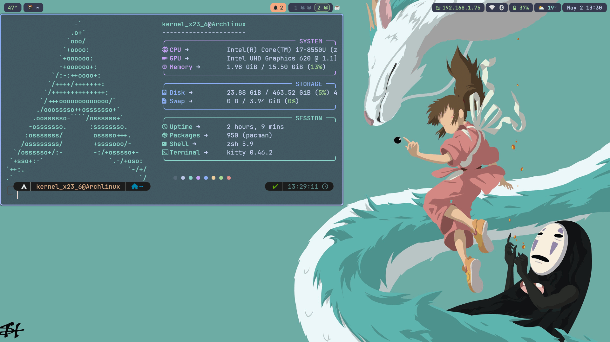
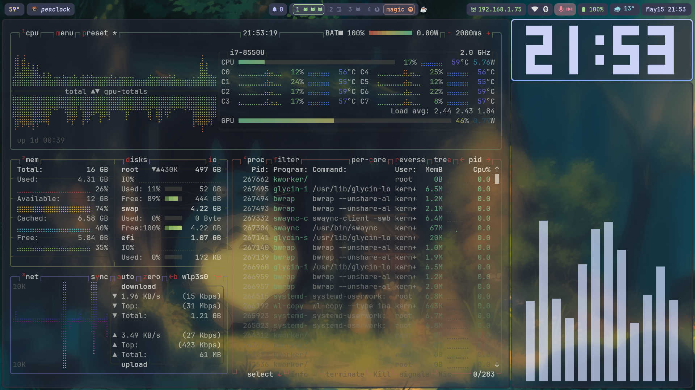
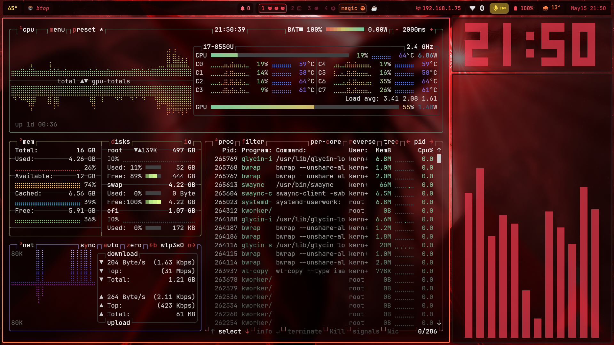
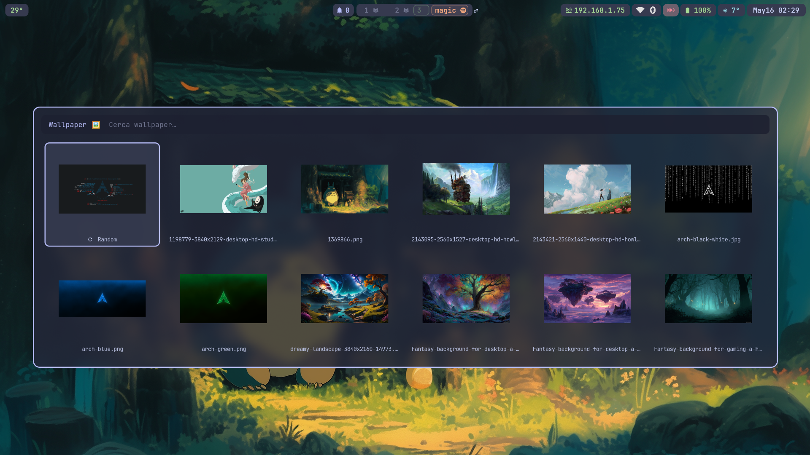
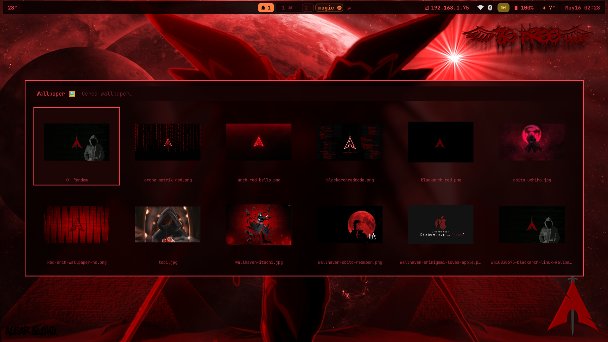
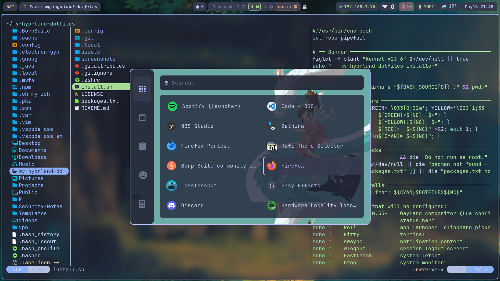
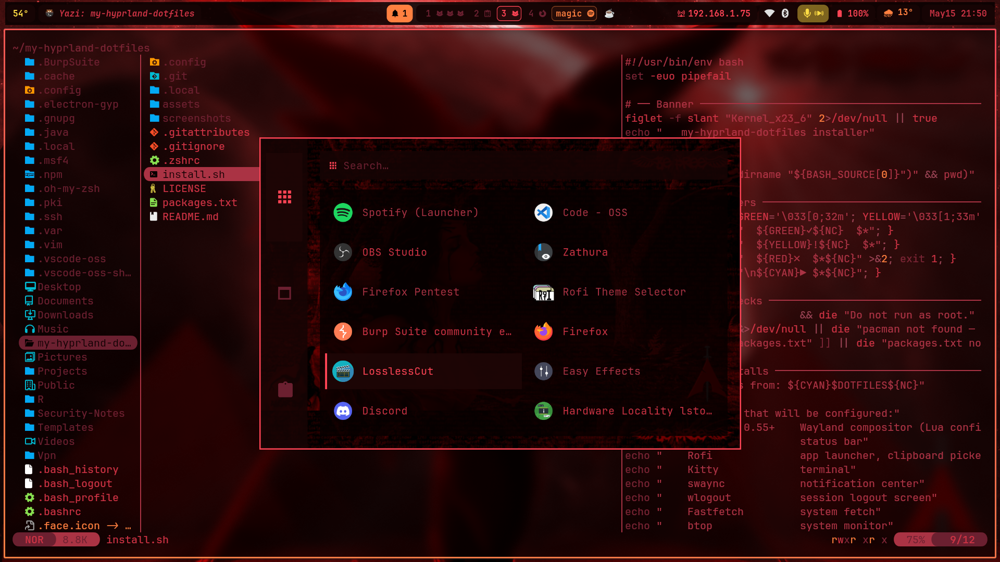

# my-hyprland-dotfiles

[](https://github.com/Kernel236/my-hyprland-dotfiles/actions/workflows/ci.yml)
[](https://github.com/Kernel236/my-hyprland-dotfiles/stargazers)
[](https://github.com/Kernel236/my-hyprland-dotfiles)

Hyprland rice for Arch Linux with a dual-theme system: **Catppuccin Macchiato** for daily use and **red-on-black**, for when the mood calls for it. Theme switching is live with one click in the bar or a keyboard shortcut, and every component updates without restarting anything.

The goal is a Hyprland setup that is ready for daily use out of a fresh Arch install. The architecture is modular without becoming overly complex: no config overrides, no duplicate files, and no need to rebuild everything just to customize it. 
It sits between a minimal base dotfile and a fully-featured rice like the most popular ones. Almost every config file includes inline comments pulled from the official documentation, so experimenting with options is quick and low-friction.
The aim is not just to look polished, but to stay practical, readable, and easy to extend.

---

## Preview



## Workflow demo

Full workflow demo on r/unixporn: [My first Hyprland full dual setup, no preconfig](https://www.reddit.com/r/unixporn/comments/1t1uams/my_first_hyprland_full_dual_setup_no_preconfig_no/) 
- New features have been added since that video.

---

## Screenshots

<table>
  <tr>
    <th>Catppuccin Macchiato</th>
    <th>Red on Black</th>
  </tr>
  <tr>
    <td></td>
    <td></td>
  </tr>
  <tr>
    <td></td>
    <td></td>
  </tr>
  <tr>
    <td></td>
    <td></td>
  </tr>
</table>

---

## Components

| Role | Tool |
|---|---|
| Compositor | Hyprland 0.55+ (Lua config) |
| Bar | Waybar |
| Terminal | Kitty |
| Notification center | sway-notification-center |
| App launcher | Rofi (Wayland) |
| Fetch | Fastfetch |
| Logout screen | wlogout |
| System monitor | btop |
| Wallpaper daemon | awww |
| Lock / idle | hyprlock + hypridle |
| Clipboard | cliphist + wl-paste |
| Editor | Neovim (lazy.nvim, LSP, Treesitter) |
| Shell | Zsh + Oh My Zsh + Powerlevel10k |
| File manager | yazi |

**Font:** JetBrainsMono Nerd Font  
**Icons:** Tela-circle-dracula — `yay -S tela-circle-icon-theme-dracula-git`  
**GTK theme:** Catppuccin Macchiato — `yay -S catppuccin-gtk-theme-mocha`

---

## Installation

> Arch Linux only. This setup assumes a mostly clean Arch base install with internet access and yay available or installable.

1. Clone the repo:
   ```bash
   git clone https://github.com/Kernel236/my-hyprland-dotfiles ~/my-hyprland-dotfiles
   ```

2. Run the installer:
   ```bash
   cd ~/my-hyprland-dotfiles
   bash install.sh
   ```

   The installer will:
   - Check and install missing packages via `yay`
   - Ask whether to install optional components: **Kitty**, **Zsh + Oh My Zsh**, **Neovim**. Answering `n` skips the packages and the symlink for that component
   - Create symlinks from `~/.config/` into the repo
   - Copy wallpapers and assets to `~/.config/assets`
   - Initialize the macchiato theme

3. Log out and back in, then start Hyprland:
   ```bash
   uwsm start hyprland
   ```

Any future edit to the repo is reflected immediately. Symlinks keep `~/.config/` in sync with the repo.

To add the BlackArch repository (optional), follow the official instructions at https://blackarch.org/downloads.html#install-repo

If something does not work after install, see [TROUBLESHOOTING.md](TROUBLESHOOTING.md).

---

## Uninstallation

`uninstall.sh` reverses everything the installer did while leaving the system bootable.

```bash
bash ~/my-hyprland-dotfiles/uninstall.sh
```

What it removes:
- Config symlinks in `~/.config/` (only if they point into this repo)
- Scripts in `~/.local/bin/` (same guard)
- `~/.config/assets`
- `~/.zshrc` symlink, `~/.oh-my-zsh`, restores default shell to bash

What it keeps:
- `sddm`, `hyprland`, `uwsm`, `kitty`, `yay`, `pacman-contrib`, so the system stays bootable

Packages from packages-core.txt and packages-optional.txt are listed before removal and require a second confirmation. Once you install another DE you can cleanly remove Hyprland with:

```bash
yay -Rns hyprland uwsm xdg-desktop-portal-hyprland
```

---

## Theme switching

Switch theme from the bar (click the theme indicator) or directly from a terminal:

```bash
~/.config/waybar/scripts/theme-switch.sh macchiato
~/.config/waybar/scripts/theme-switch.sh matrix
```

The script swaps symlinks for Hyprland, Waybar, Kitty, swaync, Rofi, Fastfetch, and hyprlock simultaneously. No restart needed.

---

## Neovim

Config lives in `.config/nvim/` and is symlinked to `~/.config/nvim` by the installer.

**Plugin manager:** lazy.nvim (auto-bootstrapped on first launch)

**LSP servers** (auto-installed via Mason on first launch):

| Language | Server |
|---|---|
| Python | pyright |
| Lua | lua-language-server |
| Bash | bash-language-server |
| C / C++ | clangd |
| HTML | html-lsp |
| CSS | css-lsp |
| Rust | rust-analyzer |

Remove the languages you do not use.

**Plugins:** Telescope, nvim-treesitter, nvim-cmp + LuaSnip, lualine, indent-blankline, nvim-autopairs, nvim-surround, catppuccin

**Theme:** Catppuccin Macchiato with transparent background. Opacity and blur are managed by Hyprland on the Kitty window.

**First launch:** Mason installs all LSP servers automatically (takes ~1-2 min on first launch).

---

## Wallpapers

Wallpapers are split by theme in `assets/backgrounds/`:

- `whitehat/` — used with macchiato (anime, landscapes, Studio Ghibli)
- `blackhat/` — used with matrix (dark Arch, Uchiha, BlackArch)

The wallpaper picker (`Super + Shift + W`) opens a Rofi gallery. A random wallpaper from the active theme folder is also set automatically on login.

---

## Keybinds

A cheatsheet overlay is available at any time with `Super + I`. All bindings are defined in `.config/hypr/conf/keybinds.lua`.

---

## Structure

```
my-hyprland-dotfiles/
├── .config/                mirrors ~/.config/ - each subdirectory is symlinked by install.sh
│   ├── hypr/               Hyprland config (Lua), hypridle, hyprlock, scripts, themes
│   ├── waybar/             bar config, per-module CSS, scripts, themes
│   ├── kitty/              terminal config and themes
│   ├── swaync/             notification center config and themes
│   ├── rofi/               launcher, wallpaper picker, themes
│   ├── fastfetch/          per-theme fetch configs
│   ├── wlogout/            logout screen layout and icons
│   ├── btop/               system monitor config
│   └── nvim/               Neovim config (lazy.nvim, LSP, Treesitter, catppuccin)
├── .zshrc                  Zsh config (Oh My Zsh, powerlevel10k, autosuggestions)
├── .local/
│   └── bin/                rofi-launcher, rofi-wallpaper, rofi-clipboard
├── assets/                 wallpapers, icon pack archive, GTK theme archive
├── screenshots/            preview GIFs for the README
├── packages-core.txt       required packages (always installed)
├── packages-optional.txt   optional packages (Kitty, Zsh, Neovim - installer asks)
├── install.sh              installer - symlinks, packages, optional components
├── uninstall.sh            uninstaller - removes symlinks, assets, packages
├── README.md
└── TROUBLESHOOTING.md      common issues and fixes
```
